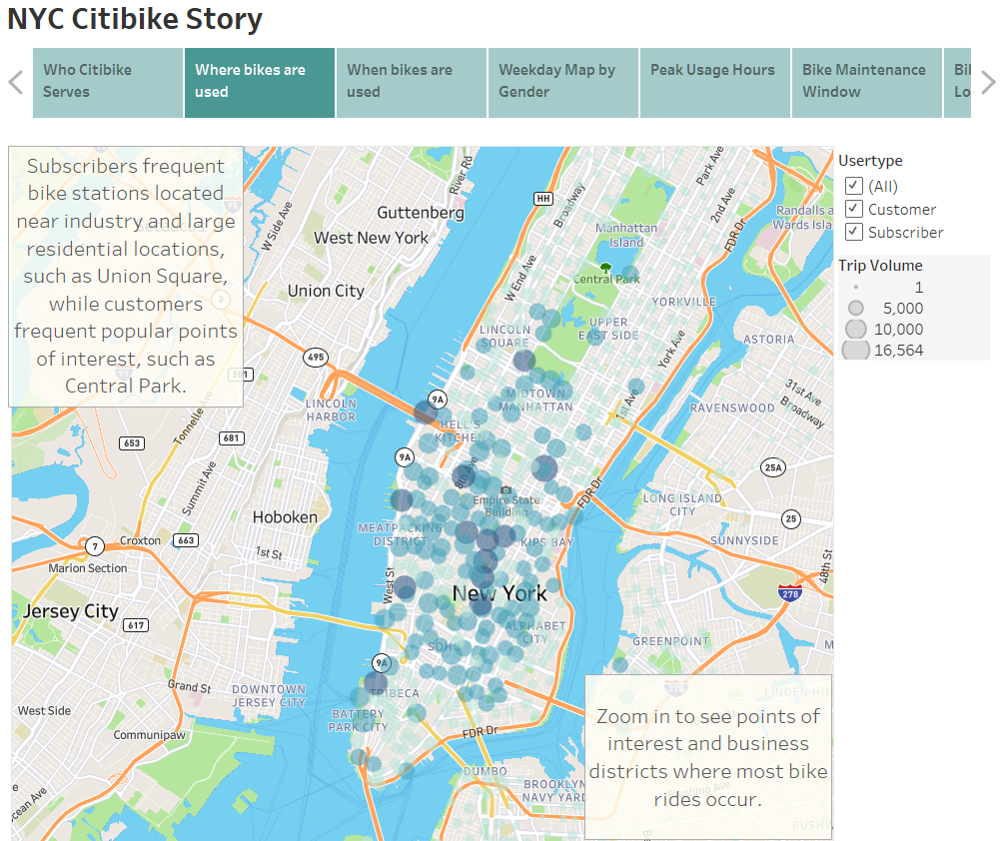

# Overview
The purpose of this analysis is to examine New York City's Citi Bike Ride-sharing data to determine whether a similar business model would be profitable in Des Moines, IA. Citi Bike makes historical data available to the public, and August 2019 rides were used to develop the analysis. The analysis focuses on the number of bike rides, who uses the bikes, and where the highest usage areas occur during the month examined in the dataset.

## About Citi Bike
Citi Bike is the nation's largest bike share program, with 20,000 bikes and 1,300 stations across Manhattan, Brooklyn, Queens, the Bronx and Jersey City. The service is designed for quick trips (less than 50 minutes). Pricing ranges from $3.50 for a single 30 minute ride, up to an annual membership (subscriber) for unlimited 45-minute rides at $15.42 per month. Visit the website here: <a href="https://citibikenyc.com/pricing">Citi Bike Pricing</a>.

## Technologies Used in Analysis
The dataset was imported as a DataFrame in Jupyter Notebook, and the trip duration was converted to a datetime format to better analyze bike usage hour / minute format. The Jupyter file is located <a href="NYC_Citibike_Challenge.ipynb">here</a>. Tableau Public was used to develop analysis and a dashboard story for this project. The tableau story can be viewed here: <a href="https://public.tableau.com/app/profile/teresa.l.wehmeier/viz/NYCCitiBike-SharingChallenge/NYCCitibikeStory?publish=yes">NYC Citi Bike Story</a>.

# Results
There were minimum requirements for this analysis defined by the project team, which include seven visualizations that analyze:

#### The number of bike trips for each type of user and gender for each day of the week

The image above provides an overview of who Citi Bike serves, and when they are served. From the above image we know:
1. There were 2,344,244 bike rides in the month of August, 2019.
2. 81% of all user types are subscribers.
3. Three times more males than females use the service during August 2019.
4. Thursday evening is the highest bike ride period, and the majority of those riders are male.
5. Customers are more frequent on Saturday and Sunday, while Subscribers use the bikes during the work week.

#### The number of bike trips for all riders for each hour of each day of the week

The above heat map shows the highest user traffic per weekday and hour of the day. From this chart we know:
1.  Most frequent bike ride times are between 7 and 9 am. and 5 and 7 pm. 
2.  Highest usage is Monday through Friday for all users.
3.  Filter on customer user types, and customers have a higher use on weekends between 11 am. and 6 pm.
4.  Thursdays between 5 pm. and 7 pm. has the highest bike rides for the week.
5.  Wednesday has very low ride usage compared to the rest of the work week.

#### The number of bike trips for all riders by gender for each hour of each day of the week
-   

The above image shows the number of bike rides by weekday and hour of day, broken down by gender. User type filter is also included to show when each tpye uses the bikes. We know:
1. Males make up the majority of all bike rides, and for both user types (subscriber and customer).

#### Bike share usage by hour of the day
-   

The above image shows bike usage frequency by hour of the day. Low usage hours are between midnight and 5 am, which makes these times prime repair and maintenance times.

#### The length of time that bikes are checked out for all riders and genders

1. The above chart shows the frequency of checkout times per hour of the day for each bike ride.

#### Other Important Analysis Finds
In addition, there were some key points during the analysis that are important to examine in detail. When and where specific types of users (subscriber or customer) access bikes, and for what purpose, are key to the analysis. A street map was developed to help with this analysis that marks locations on the map where bikes are checked out and by which user type, along with a point of interest map layer to identify key locations for these bike checkouts.

- Subscriber density is located near industry and larger commuter sources, such as Grand Central Station and Union Square:
   

- Customer density is located around popular tourist locations, such as museums, zoos and shopping:
   

# Summary
Citi Bike serves one of the most densely populated cities in the world. Over 81% of all Citi Bike users are subscribes, who purchase annual or monthly passes primarily for the purpose of communting to and from work. However, New York City also hosts a large tourist industry, and Citi Bike's customer base includes almost 20% from that tourism industry. In August 2019 alone, over 2.3 million bikes were used, mostly by subscribers during the work week (Monday - Friday), but also by nearly 445,000 tourists, who fill in the weekend non-commuter period. Based on pricing available on the website, gross revenue in the month of August 2019 is conservatively $28,517,685 for subscribers and $6,657,975 for customers, or a total month's conservative gross estimate of $35,175,660.

During this analysis more questions were raised and should be answered to help better predict success with a similar investment in Des Moines. 
1. How does weather impact usage? A precipitation layer on the map may reveal patterns based on changes in weather in NYC for the month of August.
2. Weather differences between Des Moines and New York City would also be advised.
3. A year-long Citi Bike dataset should be compiled to see usage based on month, and trends over multiple years.
4. If Des Moines adopts a similar model to Citi Bike, it is important to study commuters in the city, and where those commutes start or end (near the Capitol for example).
